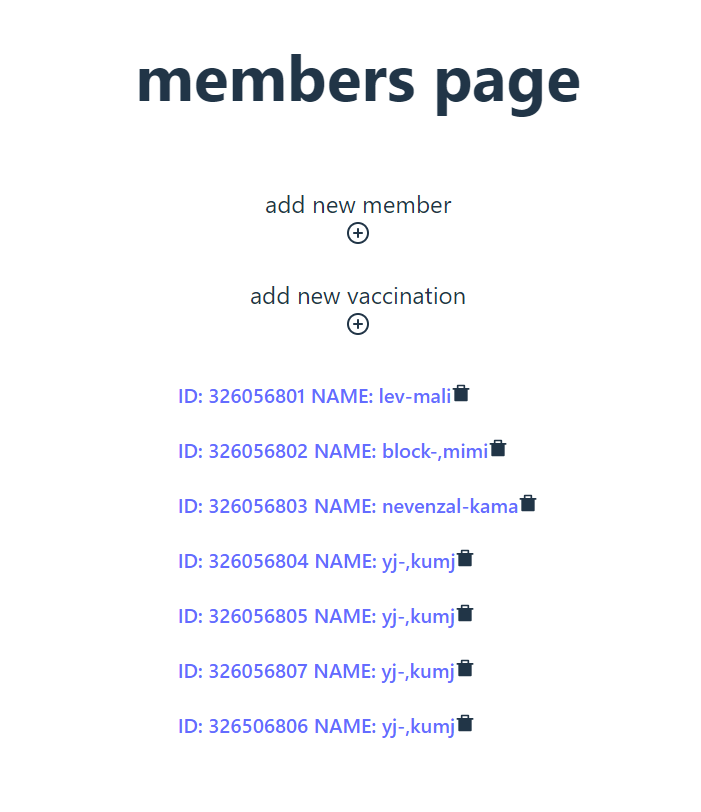
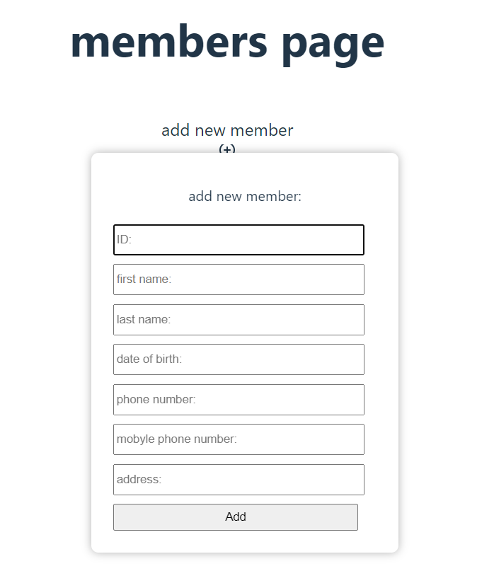
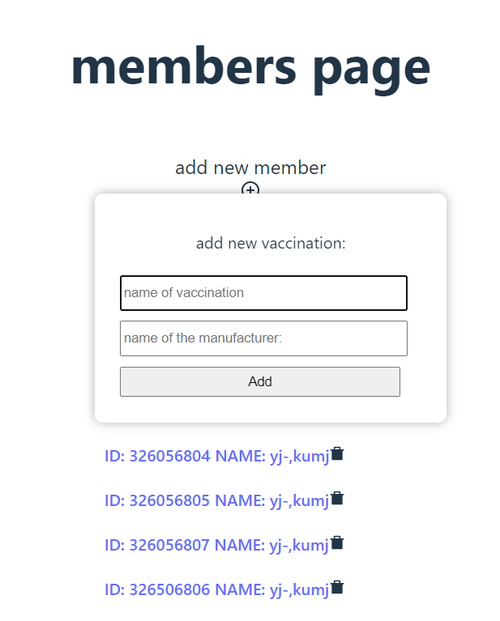
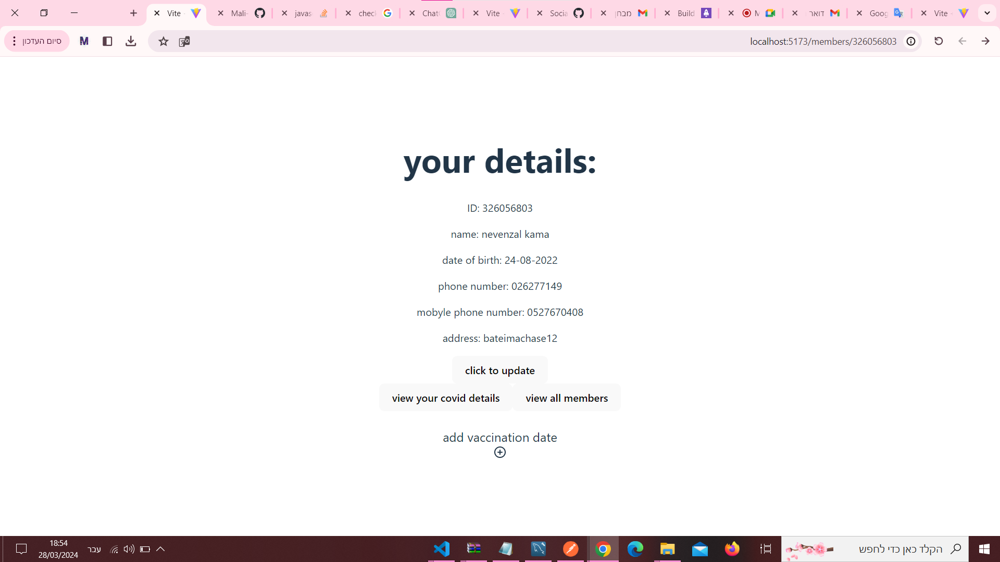
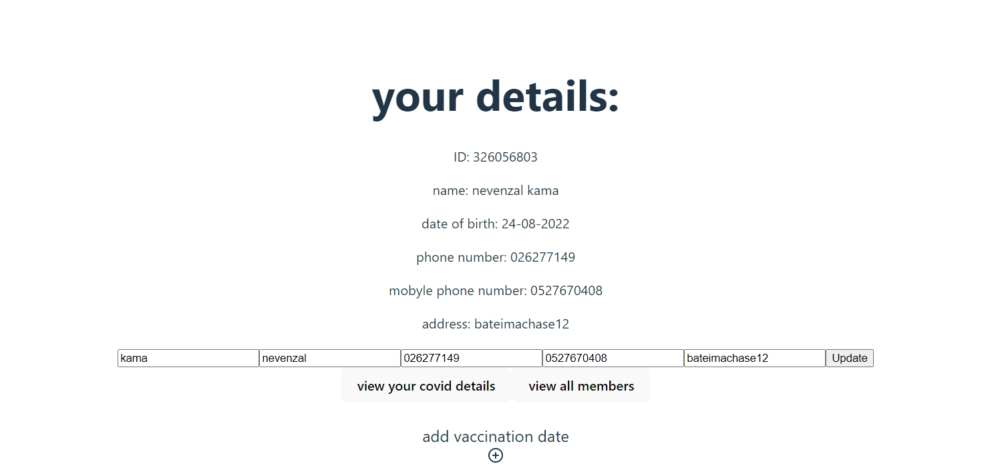
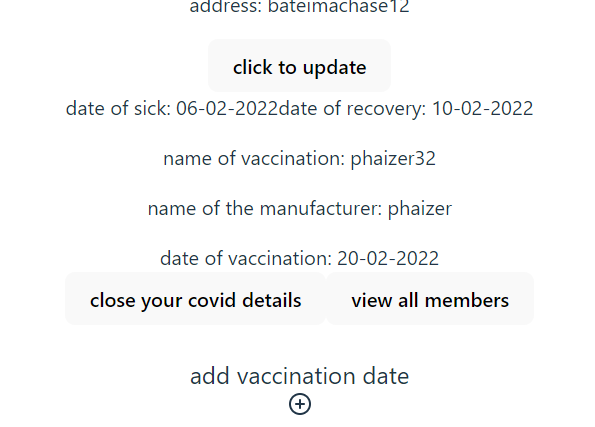
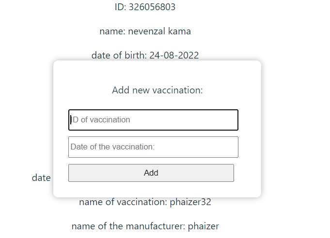

# Corona Management System
Adds deletes and updates data about HMO members.


## 










## Built With
React ,
node.js ,
MySql.

## Run Locally

Clone the project

```bash
git clone https://github.com/Mali-Nevenzal/HADASIM/tree/main/CoronaManagementSystem
```

Go to the server directory:

```bash
cd server
```

Install dependencies:

```bash
npm -v
  ```
```bash
npm i nodemon
  ```  
  ```bash
npm i mysql2
  ```
```bash
npm install express
  ```
  ```bash
npm install cors
  ```
Start the server

```bash
npm run start
```


Go to the client directory:
```bash
cd client
  ```
  ```bash
npm install react-router-dom
  ```
```bash
npm Install date-fns
```  
```bash
npm install reactjs-popup –save
```
```bash
npm i react-icons
```
```bash
cd client
```
Start the client:

  ```bash
npm run dev
  ```


